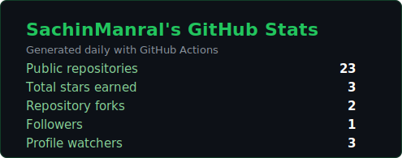
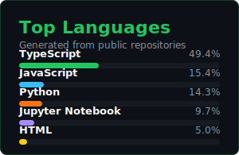

<p align="center">
  <a href="./fallout_grayscale%20(1).gif">
    
  </a>
</p>

<div align="center">


<br />

[](https://github.com/SachinManral)&nbsp;
[](https://github.com/SachinManral?tab=followers)&nbsp;
[](https://github.com/SachinManral)&nbsp;
[](mailto:sachinmanral2431@gmail.com)

</div>

---

## About Me

<table>
  <tr>
    <td width="50%">
      <strong>What I am building around</strong><br />
      Full-stack products powered by clean interfaces, reliable backends, and practical AI/ML workflows.
    </td>
    <td width="50%">
      <strong>What I am improving</strong><br />
      Advanced DSA, ML frameworks, system design, and production-ready MERN / Next.js projects.
    </td>
  </tr>
</table>

```typescript
const sachin: Developer = {
  name: "Sachin Manral",
  location: "India",
  role: "Full-Stack Developer & AI Enthusiast",

  currentFocus: [
    "Advanced DSA & ML Frameworks",
    "React, Next.js, Node.js & Supabase projects",
    "AI + Web Development fusion",
    "Open Source & Research contributions",
  ],

  techStack: {
    languages: ["Python", "Java", "JavaScript"],
    backend: ["Node.js", "Express.js"],
    databases: ["MySQL", "PostgreSQL", "MongoDB", "Supabase"],
    frontend: ["React", "Next.js", "Tailwind CSS", "Angular", "HTML", "CSS"],
    aiml: ["TensorFlow", "PyTorch", "Keras", "scikit-learn", "SciPy"],
    devops: ["Docker", "AWS", "GCP", "Git", "VS Code", "IntelliJ IDEA"],
  },

  currentlyLearning: ["Advanced DSA", "ML Frameworks", "System Design"],
  openTo: ["Open Source", "AI/ML collaborations", "Full-Stack projects"],
  resume: "https://drive.google.com/file/d/1hWT7BTiDAXIW96qnGviv_WTKa7sMVn-U/view",
};
```

---

## GitHub Analytics

> These stats cards are self-hosted via GitHub Actions and refresh daily.

<div align="center">

[](https://github.com/SachinManral/SachinManral/actions/workflows/grs.yml)
[](https://github.com/SachinManral)

<br /><br />


&nbsp;


<br /><br />


&nbsp;


<br /><br />


</div>

---

## Profile Summary

<div align="center">


<br/>


&nbsp;


<br/>


&nbsp;


</div>

---

## GitHub Trophies

<div align="center">


</div>

---

## Tech Stack

<div align="center">

**Languages**


**Backend & Databases**


**Frontend & Design**


**AI / ML & DevOps**


<br />


</div>

---

## Connect With Me

<div align="center">

[](https://www.linkedin.com/in/sachin-manral/)
[](https://github.com/SachinManral)
[](https://leetcode.com/u/SachinManral/)
[](https://x.com/sa_xhinn)
[](mailto:sachinmanral2431@gmail.com)

<br /><br />

<a href="https://github.com/SachinManral">
  
</a>

<br /><br />


<br />

<p><strong>This README is uniquely designed by <a href="https://sachinmanral.com/" target="_blank">Sachin Manral</a></strong></p>

</div>


